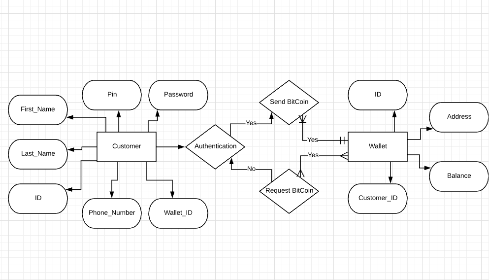
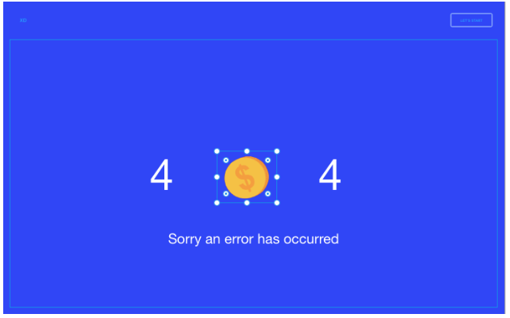
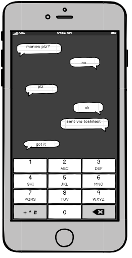
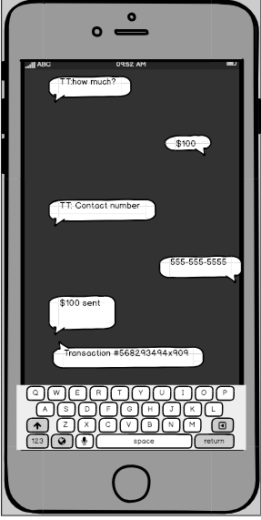

<p align="center">
    
</p>

# toshiText

*toshiText is an application to send bitcoin transactions via text message.*

This a class project developed by five students for the Software Product Development class (SPD) 1.3 at Make School in San Francisco, California.

## Goal of ToshiText
To enable people across the world to take control of their personal finances.

### Documentation
To learn more about toshiText visit our [documentation site](https://jasmines-co.github.io/best_website_ever/)

## Built With
* [Node](https://nodejs.org/en/) - Node
* [MongoDB](https://www.mongodb.com/) - Document based database
* [Next.js](https://nextjs.org/) - React framework for rendering server side apps

## API Integrations
* [Twilio](https://www.twilio.com/) - Send text messages
* [BlockCypher API](https://www.blockcypher.com/dev/bitcoin/) - create bitcoin wallets and send transactions

## ERD
<p align="center">
    
</p>

## Command Structure
`send <amount> <destination number>`

## Examples
```
send mbtc0.004 4150000000
send $4 5031234567
```

## Wireframes
<p align="center">
    
     
    
    
</p>

## File Structure 
```
root/
|
|-- pages/              
|        |--index.js
|        |--request.js
|        |--wallet.js
|        |--team.js
         |--team.js
|
|-- routes/               
        |-- users.js
        |-- requests.js
|
|-- models/                     
      |-- Account.js
      |-- Request.js
      |-- User.js
|
|-- services/                     
      |--Auth0.js
|
|-- static/ 
      |--favicon/
            |-- favicon-small.png
      |-- images/
      
|-- config/                     
|     |-- dev.js
      |-- index.js
      |-- prod.js
      
|
|-- styles/                 
      |-- main.scss/
|
|-- env files                 
|-- server.js                
|-- next.config.js            
|-- env.config.js 
|-- .babelrc.js
|-- README.md
|-- misc
```

### Try it yourself
To begin using the project:

* clone it
* rename `.env.example` to `.env` 
* change the example keys in `.env` to your own
* start your database
* start the app

#### Example
```
$ git clone git@github.com:jasmines-co/best_website_ever.git
$ cd best_website_ever
$ npm install
$ cp .env.example .env
$ mongod
$ npm run dev
```

## Deploy it yourself
To deploy to Heroku:

```
git clone git@github.com:jasmines-co/best_website_ever.git
mongod
npm run dev
git add .
git commit -m 'deploying to heroku'
heroku create my-cool-app-name
git remote -v
heroku ps:scale web=1
heroku addons:create mongolab:sandbox
git push heroku master
```

## Live Version 
Live version - http://toshi-text.herokuapp.com/

## Developers
### Jasmine Anderson
  - Role: Backend Engineer
  - Technologies: Node, Express, Handlebars, MongoDB
### Kendra Moore
  - Role: Frontend Engineer
  - Technologies: Node, Express, MongoDB, Next
### Sukrobjon Golibboev
  - Role: Backend Engineer
  - Technologies: Node, Express, MongoDB
### Fodé Diop
  - Role: Senior Backend Engineer
  - Technologies: Node, Express, MongoDB
### Jasmine Humbert
  - Role: Product Manager
  - Technologies: Node, Express, MongoDB, Google Cloud, Git/Github


